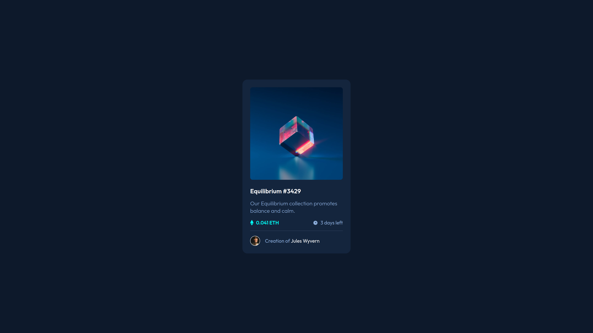

# Frontend Mentor - NFT preview card component solution

This is a solution to the [NFT preview card component challenge on Frontend Mentor](https://www.frontendmentor.io/challenges/nft-preview-card-component-SbdUL_w0U). Frontend Mentor challenges help you improve your coding skills by building realistic projects.

## Table of contents

- [Overview](#overview)
  - [The challenge](#the-challenge)
  - [Screenshot](#screenshot)
  - [Links](#links)
- [My process](#my-process)
  - [Built with](#built-with)
  - [What I learned](#what-i-learned)
  - [Continued development](#continued-development)
  - [Useful resources](#useful-resources)
- [Author](#author)

## Overview

### The challenge

Users should be able to:

- View the optimal layout depending on their device's screen size
- See hover states for interactive elements

### Screenshot



### Links

- Solution URL: [GitHub](https://github.com/paatre/product-preview-card-component-main)
- Live Site URL: [GitHub Pages](https://paatre.github.io/product-preview-card-component-main)

## My process

### Built with

- Semantic HTML5 markup
- CSS custom properties
- BEM naming convention
- SCSS
- Flexbox
- Mobile-first workflow

### What I learned

#### Properly centering an element vertically to full viewport

From last challenges, I noticed there were some problems with vertical centering of my `main` element. The element seemed to be fine when rendering the site. But when I started to zoom in, the upper part of the element was cut off. I didn't know why but then I started to research what was going on.

And I found the exact problem! I had set `body` `height` as fixed `100vh` which meant that when I zoomed in, the height didn't take into consideration the content on the page which led to the `main` element being cut. I read more what could be the solution to the problem. On top of that, I found out using `100vh` with `height` introduces other problems as well with mobile screens and gradients (more of these problems in the [Useful resources](#useful-resources)). To all these problems, a solution was found:

```scss
html {
  min-height: 100%;
  display: flex;
  flex-direction: column;

  body {
    flex-grow: 1;
  ...
  }
}
```

There are two parts:

1. We need to set `html` *initial* height as 100%. But to make the page responsive when it renders content, not just the viewport height, we don't want to use fixed heights. That's why we set `min-height` as `100%`. With that, the HTML element can grow to be bigger than its initial size, but not smaller. `body` element gets the same initial size as the `html` has when the site is rendered.

2. We want `body` element to be stretching as well! We have set `html` element as a flex parent and with that, we can set `body` element's `flew-grow` as `1` so that the `body` grows in the size when its parent, `html`, does.

I'm not going to explain this solution as whole read. Go read the resource, it explains the matter really well! But I'm so happy I got this to work and I now know what was the problem and how to fix it!

#### Overlay SVG icon with a background color on hover

I did it! 🎉 I wasn't sure how to do the overlay for the card image when I started this challenge. At one point, I was going to do it with more elements than just the one `img` inside the container but I wanted to try to do it with the `::after` pseudo-element. I'm not sure if using `padding` the way I use it here to fill the icon's background was the best way to do it, but it's a way. Maybe there's something I could have done with the SVG photo itself or something. But all in all, the solution looks neat with the added transition.

```html
<div class="card__image-container">
  
</div>
```
```scss
&__image-container {
  position: relative;
  border-radius: 8px;
  width: 100%;
  height: 100%;
  overflow: hidden;
  cursor: pointer;

  &::after {
    content: url('../images/icon-view.svg');
    display: block;
    position: absolute;
    top: 50%;
    left: 50%;
    transform: translate(-50%, -50%);
    padding: calc((300px - 48px) / 2);
    opacity: 0;
    transition: opacity .5s ease;
    background-color: var(--primary-cyan-transparent);
  }

  &:hover::after {
    opacity: 1;
  }
}

&__image {
  width: 100%;
  vertical-align: middle;
}
```

By the way, regarding `::after` and `::before` pseudos, they don't apply to *replaced elements* such as ``:

> Note. This specification does not fully define the interaction of :before and :after with replaced elements (such as IMG in HTML). This will be defined in more detail in a future specification.

More you know!

#### Styling the hr tag

Oh yeah, if I want to style an `<hr>` to be a really thin line, I need to remove its borders first and then add a background color. Otherwise, I can't see the style change.

```scss
&__separator {
  height: 0.5px;
  margin: 16px 0;
  background-color: var(--separator);
  border: none;
}
```

### Continued development

I really need to check out the MDN reference for SVGs. Also, I want to understand all the nuances with `height` and `width` attributes.

### Useful resources

- [Stretching body to full viewport height: the missing way](https://dev.to/fenok/stretching-body-to-full-viewport-height-the-missing-way-2ghd) - The number one resource for me regarding vertical centering and stretching problems and how to tackle them.
- [MDN: ::after](https://developer.mozilla.org/en-US/docs/Web/CSS/::after)

## Author

- GitHub - [@paatre](https://github.com/paatre/)
- Frontend Mentor - [@paatre](https://www.frontendmentor.io/profile/paatre)
- Twitter - [@teemuviikeri](https://twitter.com/TeemuViikeri)
